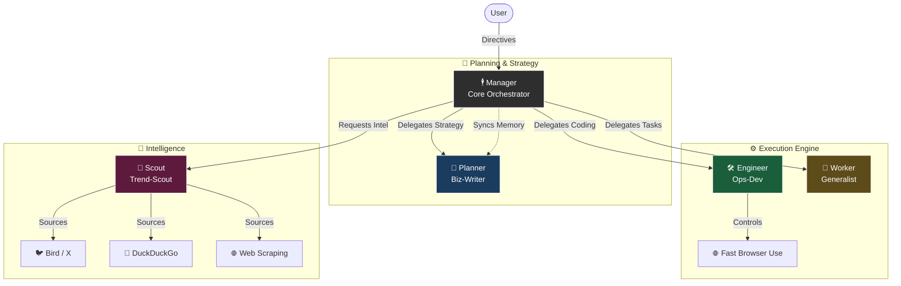

# OpenClaw Agent Squad Architecture 🕴️💎

## 🧱 The Structure (One Team, One Mission)

Your OpenClaw system operates as a **hierarchical squad** (Top-Down Command Structure).

## 🎭 Agent Roster & Roles

### 1. 🕴️ Manager (Main Agent)
- **Role**: **CEO / PM / 총괄 지휘관**
- **Model**: `GPT-5.2 Codex` (⚠️ Active)
    - *Original*: `Claude 4.5 Opus Thinking` (Deep Reasoning) - **Currently Limit Reached**
- **Responsibility**: 
    - 사용자의 불분명한 지시를 구체적인 계획으로 변환
    - 하위 에이전트(Planner, Engineer, Scout)에게 작업 분배
    - 최종 결과물 검수 및 보고 (Quality Control)

### 2. 📝 Planner (Biz-Writer)
- **Role**: **기획자 / 문서 작성 전문가**
- **Model**: `GPT-5.2 Codex` (⚠️ Active)
    - *Original*: `Claude 4.5 Opus Thinking` (Deep Reasoning) - **Currently Limit Reached**
- **Responsibility**:
    - 사업계획서, 제안서, 마케팅 문구 작성
    - 논리적 구조화 및 전략 수립
    - `fs` 툴을 사용해 문서 파일 생성/관리

### 3. 🛠️ Engineer (Ops-Dev)
- **Role**: **개발자 / 시스템 관리자**
- **Model**: `GPT-5.2 Codex` (High-Performance Coding)
- **Responsibility**:
    - 코드 작성, 디버깅, 시스템 설정
    - **브라우저 제어 (`fast-browser-use`)** 담당 (스크린샷, 크롤링)
    - 스킬 설치 (`clawhub`) 및 유지보수

### 4. 📡 Scout (Trend-Scout)
- **Role**: **리서치 / 정보 수집가**
- **Model**: `Gemini 3 Pro High` (Massive Context)
- **Responsibility**:
    - **3중 교차 검증**: 트위터(`bird`) + 검색(`duckduckgo`) + 웹(`scraping`)
    - 최신 트렌드, 뉴스, 경쟁사 데이터 수집
    - 인사이트 도출 및 자동 아카이빙

### 5. 🔧 Worker
- **Role**: **자동화 봇 / 인턴**
- **Model**: `GPT-5.2 Codex` (Efficient Execution)
- **Responsibility**:
    - 단순 반복 작업 (이메일 발송, 데이터 정리)
    - 쿠팡 등 API 연동 작업 보조

---

### 🔗 How They Connect?
- **Delegation Protocol**: Manager는 직접 손을 쓰기보다, "Dev에게 스크린샷 찍어, Scout에게 조사해"라고 **위임 명령**을 내립니다.
- **Shared Memory**: 모든 파일(`data/`, `workspace/`)은 공유되므로, Scout이 조사한 자료를 Planner가 읽어서 바로 기획서를 쓸 수 있습니다.
