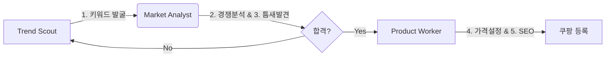

# ⚙️ 5단계 소싱 전략 자동화 설계도 (Automation Pipeline)

사용자님이 정의한 **"필승 5단계 전략"**을 기계적으로 자동화하기 위한 설계입니다.

## 1. 🏗️ 전체 구조 (Architecture)
이 시스템은 **3개의 에이전트**가 이어달리기 하듯 작동합니다.

## 2. 🧩 단계별 구현 방법 (Implementation)

### ✅ Step 1. 트렌드 발굴 (Trend Scout) - **Multi-Channel Scouting**
*   **역할**: "무엇이 뜨고 있는가?" 전방위 데이터 수집
*   **활용 스킬 (Skills)**:
    1.  **Twitter (`bird` skill)**: 실시간 SNS 트렌드 및 바이럴 해시태그 파악.
    2.  **YouTube (`youtube-watcher` skill)**: 인기 급상승 동영상(Shorts/Review)에서 제품 트렌드 추출.
    3.  **Coupang (`fast-browser-use` skill)**: 브라우저를 직접 띄워 '베스트/골드박스' 정밀 스크래핑 (데이터랩의 맹점 보완).
*   **자동화 로직**:
    1.  **매일 오전 8시**: 위 3개 채널 동시 가동.
    2.  **데이터 교차 검증**: 유튜브에서 뜨고 + 쿠팡 랭킹에도 진입한 "확실한 놈"만 추출.
    3.  결과물: `candidate_keywords.json` 생성.

### ✅ Step 2 & 3. 분석 및 필터링 (Market Analyst) - **핵심(Core)**
*   **역할**: "이거 들어가도 되는 시장인가?" 판단 (**지능 필요**)
*   **기술(Tech)**: `Claude-Code` (LLM Analysis) + `Crawler`
*   **자동화 로직**:
    1.  후보 키워드로 쿠팡 검색 결과(1~5위) 상세페이지 스크래핑.
    2.  **Claude에게 데이터 전송**:
        *   *"이 리뷰들 읽어보고 불만 사항(Gap) 찾아내."*
        *   *"이 가격(평균 1만원)에 우리가 6천원에 공급하면 경쟁력 있어?"*
    3.  **기준 미달 탈락**: 독과점이 심하거나 마진이 안 나오면 즉시 폐기.

### ✅ Step 4 & 5. 실행 및 등록 (Product Worker)
*   **역할**: "물건 떼오고 예쁘게 포장하기"
*   **기술(Tech)**: `Domeggook Crawler` + `Coupang API`
*   **자동화 로직**:
    1.  도매꾹에서 [Step 2] 통과한 스펙의 상품 최저가 검색.
    2.  **스마트 작명**: Claude가 "감성 키워드" 섞어서 제목 다시 짓기.
    3.  **API 송신**: 최종 가공된 데이터를 쿠팡 서버로 전송.

## 3. 🔑 핵심 선결 과제 (Prerequisite)
이 자동화의 **심장(Heart)**은 **Step 2, 3, 5**에 있는 **"판단(Analysis)"** 기능입니다.

---
## 관련 문서
- [[📊 대시보드|📊 대시보드]]
- [[Projects/셀픽스-쿠팡-파이프라인|🛒 쿠팡 파이프라인]]
- [[Memory/운영-규칙|⚙️ 운영 규칙]]
- [[Memory/장기기억|🧠 장기기억]]
- [[History/지금까지-한-일|📅 전체 타임라인]]
